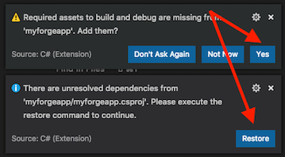

# forge-download-translated-pdf-pages


[](http://opensource.org/licenses/MIT)

[](http://developer.autodesk.com/)
[](http://developer.autodesk.com/)
[](http://developer.autodesk.com/)

# Description

This sample demonstrates how to download PDF pages and thumbnails of a PDF file stored in BIM360 Docs Plans folder by its derivative URN.

## Thumbnail


# Setup

To use this sample, you will need Autodesk developer credentials. Visit the [Forge Developer Portal](https://developer.autodesk.com), sign up for an account, then [create an app](https://developer.autodesk.com/myapps/create). For this new app, use **<http://localhost:3000/api/forge/callback/oauth>** as the Callback URL, although it is not used on a 2-legged flow. Finally, take note of the **Client ID** and **Client Secret**.

### Run locally

Install [NodeJS](https://nodejs.org).

Clone this project or download it. It's recommended to install [GitHub Desktop](https://desktop.github.com/). To clone it via command line, use the following (**Terminal** on MacOSX/Linux, **Git Shell** on Windows):

    git clone https://github.com/yiskang/forge-download-translated-pdf-pages.git
    git checkout net-core

**Visual Studio** (Windows):

Right-click on the project, then go to **Debug**. Adjust the settings as shown below.

 

**Visual Studio Code** (Windows, MacOS):

Open the folder, at the bottom-right, select **Yes** and **Restore**. This restores the packages (e.g. Autodesk.Forge) and creates the launch.json file. See *Tips & Tricks* for .NET Core on MacOS.



At the `.vscode\launch.json`, find the env vars and add your Forge Client ID and Secret.
```json
"env": {
    "FORGE_CLIENT_ID": "your id here",
    "FORGE_CLIENT_SECRET": "your secret here"
},
```

## Packages used

The [Autodesk Forge](https://www.npmjs.com/package/forge-apis) packages are included by default.

## Troubleshooting

After installing GitHub Desktop for Windows, on the Git Shell, if you see the ***error setting certificate verify locations*** error, then use the following command:

    git config --global http.sslverify "false"

# License

This sample is licensed under the terms of the [MIT License](http://opensource.org/licenses/MIT).
Please see the [LICENSE](LICENSE) file for full details.

## Written by

Eason Kang [@yiskang](https://twitter.com/yiskang), [Forge Partner Development](http://forge.autodesk.com)
